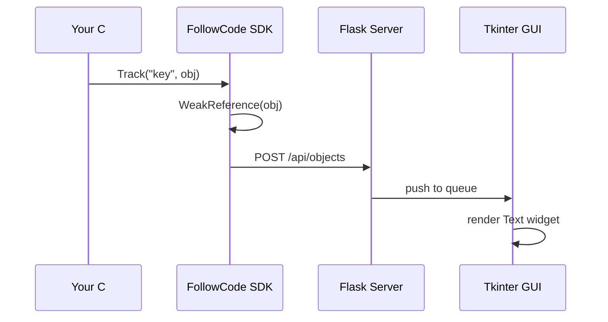
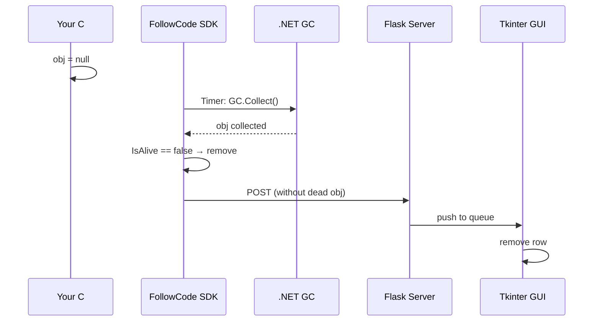

# FollowCode

Real-time C# object tracking with Python desktop dashboard.  
**Single API**: `Track()`. Objects auto-disappear when they go out of scope (WeakReference).

 

---

## Download

| File | Description |
|---|---|
| [FollowCodeDashboard.exe](https://github.com/gcoderninhph/followcode/releases/download/1.0.0/FollowCodeDashboard.exe) | Python dashboard (14 MB, portable, no Python required) |
| [FollowCode.SDK.1.0.0.nupkg](https://github.com/gcoderninhph/followcode/releases/download/1.0.0/FollowCode.SDK.1.0.0.nupkg) | C# SDK NuGet package |

> [All releases](https://github.com/gcoderninhph/followcode/releases)

---

## Quick Start

### 1. Launch Dashboard

Double-click `FollowCodeDashboard.exe` — a window opens listening on **port 42102**.


> If you have Python, you can also run: `pythonw FollowCode.Dashboard/main.pyw`

### 2. Install SDK

```bash
# From local nupkg folder
dotnet add package FollowCode.SDK --source ./path/to/nupkg
```

Or via NuGet Package Manager: `Install-Package FollowCode.SDK`

### 3. Write code

```csharp
using FollowCode.SDK;

// Auto-starts timer, auto-sends to dashboard
using var client = new FollowCodeClient(new FollowCodeConfig
{
    ServerUrl = "http://localhost:42102",
    IntervalSeconds = 1
});

// Track objects — they appear on dashboard immediately
var cpu = new MyObj { Name = "CPU", Value = 45 };
client.Track("srv-cpu", cpu);

// Mutate — dashboard updates automatically (same object via WeakReference)
cpu.Value = 90;

// Set reference to null — SDK auto-detects dead object via GC + WeakReference
cpu = null;
// → disappears from dashboard on next timer tick

// That's it. No Untrack, No Clear, No CollectGarbage.
```

---

## How It Works

### Track Flow



### Auto Cleanup Flow



### Auto Format

SDK auto-detects data type and formats accordingly:

| Type | Format | Example |
|---|---|---|
| `Dictionary` / `Map` | each entry on new line | `{`<br>`  cpu: CPU:90`<br>`  mem: Memory:33`<br>`}` |
| `List` / `HashSet` / `Queue` | each item on new line | `[`<br>`  CPU:90`<br>`  Memory:33`<br>`]` |
| `string` | as-is | `hello` |
| Other objects | `ToString()` | `CPU:90` |
| `null` | `null` | `null` |

---

## SDK API

```csharp
public class FollowCodeClient : IDisposable
{
    // The ONLY method you need
    public void Track(string key, object data);

    // Send interval (default: 5s), uses ToString() for data display
}

public class FollowCodeConfig
{
    public string ServerUrl { get; set; } = "http://localhost:42102";
    public int IntervalSeconds { get; set; } = 5;
    public int TimeoutSeconds { get; set; } = 10;
}
```

---

## Dashboard API

| Method | Endpoint | Description |
|---|---|---|
| `POST` | `/api/objects` | Receive tracked objects array |
| `GET` | `/api/objects` | Poll current objects |

**POST body format:**
```json
[
  { "key": "srv-cpu", "data": "CPU:90", "updatedAt": "2026-06-11T09:14:00Z" }
]
```

---

## Requirements

| Component | Requires |
|---|---|
| **Dashboard (exe)** | Windows 10+, nothing else |
| **Dashboard (source)** | Python 3.12+, Flask, Tkinter |
| **SDK** | .NET Standard 2.0+ / .NET 9.0 |

---

## Build from Source

```bash
# Dashboard exe (requires Python 3.12)
cd FollowCode.Dashboard
pip install flask pyinstaller
python -m PyInstaller --onefile --noconsole --name FollowCodeDashboard main.pyw

# SDK NuGet package
dotnet pack FollowCode.SDK -c Release
# → nupkg/FollowCode.SDK.1.0.0.nupkg
```

---

## License

MIT
